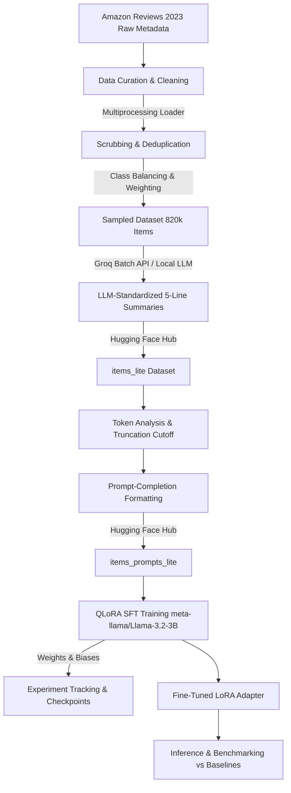

# 🏷️ Price Predictor: LLM-Powered E-Commerce Price Prediction

[](https://opensource.org/licenses/MIT)
[](https://huggingface.co/Aditya2302)
[](https://huggingface.co/meta-llama/Llama-3.2-3B)
[](https://github.com/huggingface/peft)
[](https://github.com/AdityaShenoy2302/price-predictor)
[](https://github.com/AdityaShenoy2302/price-predictor)
[](https://wandb.ai)
[](https://www.python.org/)

An end-to-end Machine Learning pipeline that fine-tunes **Meta's Llama 3.2 (3B)** using **QLoRA (4-bit Quantization)** to predict real-world e-commerce product prices directly from raw multi-category product metadata, specifications, and structured descriptions.

---

## 📌 Table of Contents

- [Overview](#-overview)
- [Pipeline Architecture](#-pipeline-architecture)
- [Project Highlights](#-project-highlights)
- [Repository Structure](#-repository-structure)
- [Step-by-Step Workflow](#-step-by-step-workflow)
  - [1. Data Curation & Preprocessing](#1-data-curation--preprocessing)
  - [2. Dataset Tokenization & Formatting](#2-dataset-tokenization--formatting)
  - [3. Supervised Fine-Tuning (SFT with QLoRA)](#3-supervised-fine-tuning-sft-with-qlora)
  - [4. Evaluation & Benchmarking](#4-evaluation--benchmarking)
- [Model & Training Details](#-model--training-details)
- [Evaluation Metrics & Baselines](#-evaluation-metrics--baselines)
- [Quickstart & Usage](#-quickstart--usage)
  - [Prerequisites](#prerequisites)
  - [Installation](#installation)
  - [Running Inference](#running-inference)
- [Experiment Tracking](#-experiment-tracking)
- [License & Acknowledgments](#-license--acknowledgments)

---

## 🔍 Overview

Can an open-weights Large Language Model accurately estimate the monetary value of complex products across diverse market segments?

Standard numerical regression models often struggle with unstructured textual attributes, unstructured technical specs, and domain-specific vocabulary. **Price Predictor** frames price estimation as a causal language generation task: given a clean, structured product summary (Title, Category, Brand, Description, Features), the fine-tuned model predicts the item's cost to the nearest dollar.

This project implements the complete ML lifecycle:
1. **Parallel ingestion and scrubbing** of hundreds of thousands of raw e-commerce items across 8 diverse retail categories.
2. **LLM-assisted text summarization & normalization** using batch inference.
3. **Parameter-Efficient Fine-Tuning (PEFT)** on a 4-bit quantized LLaMA 3.2-3B model via **TRL (Transformer Reinforcement Learning)** and **BitsAndBytes**.
4. **Interactive evaluation suite** tracking Mean Absolute Error (MAE), Mean Squared Error (MSE), and $R^2$ with running confidence intervals.

---

## 🏗️ Pipeline Architecture



---

## ✨ Project Highlights

- **Multi-Category Coverage**: Curated across 8 distinct Amazon categories:
  - *Appliances*, *Automotive*, *Cell Phones & Accessories*, *Electronics*, *Musical Instruments*, *Office Products*, *Tools & Home Improvement*, and *Toys & Games*.
- **Noise Reduction & Data Scrubbing**: Strips ASIN codes, part numbers, battery identifiers, and HTML artifacts while extracting and normalizing product weights.
- **LLM-Powered Standardization**: Uses batch LLM processing to turn verbose descriptions into structured 5-attribute summaries (`Title`, `Category`, `Brand`, `Description`, `Details`).
- **Memory-Efficient Training**: QLoRA 4-bit NF4 double quantization enables fine-tuning on consumer/free-tier GPUs (Google Colab T4) with only **~18.35M trainable parameters (1.01% of total parameters)**.
- **Zero-Leakage Test Split**: Exact float prices preserved on the test set for robust error calculations, with rounded targets during training for consistent token generation.

---

## 📁 Repository Structure

```text
price-predictor/
│
├── Data_Curation.ipynb             # Ingestion, scrubbing, weight parsing, class balancing & Hub push
├── SFT_Dataset_Preparation.ipynb   # Token distribution analysis, cutoff tuning, prompt construction
├── SFT.ipynb                       # 4-bit QLoRA fine-tuning of Llama-3.2-3B with TRL & W&B logging
├── Test_SFT_model.ipynb            # Model evaluation, Plotly error charts, and single-item inference
├── SFT Run Metrics _ price_predictor – Weights & Biases.pdf # Exported training & validation run metrics
└── README.md                       # Project documentation
```

---

## 🚀 Step-by-Step Workflow

### 1. Data Curation & Preprocessing
📄 **Notebook**: [`Data_Curation.ipynb`](./Data_Curation.ipynb)
- Ingests raw data from [`McAuley-Lab/Amazon-Reviews-2023`](https://huggingface.co/datasets/McAuley-Lab/Amazon-Reviews-2023) using a parallel chunk-based `ItemLoader`.
- Cleans and deduplicates titles and descriptions.
- Applies class-balancing and price-weighted downsampling to prevent high-volume categories (like Automotive and Tools) from dominating the distribution.
- Employs batch LLM generation to convert noisy product metadata into a concise 5-line schema:
  ```yaml
  Title: <Clean product title>
  Category: <Standardized category>
  Brand: <Brand name>
  Description: <One-sentence summary>
  Details: <Key specifications and features>
  ```
- Uploads curated splits to Hugging Face Hub as `items_raw_lite` and `items_lite`.

---

### 2. Dataset Tokenization & Formatting
📄 **Notebook**: [`SFT_Dataset_Preparation.ipynb`](./SFT_Dataset_Preparation.ipynb)
- Analyzes the token distribution using the `meta-llama/Llama-3.2-3B` tokenizer.
- Sets a summary token cutoff threshold (e.g., 110 tokens) to ensure maximum information density while minimizing padded context length.
- Formats samples into training prompt-completion pairs:
  ```text
  What does this cost to the nearest dollar?

  Title: Excess V2 Distortion/Modulation Pedal  
  Category: Music Pedals  
  Brand: Old Blood Noise  
  Description: A versatile pedal offering distortion and three modulation modes...  
  Details: Features include separate gain, tone, and volume controls...

  Price is $
  ```
- Generates train (20,000 items), validation (1,000 items), and test (1,000 items) splits and publishes to `items_prompts_lite`.

---

### 3. Supervised Fine-Tuning (SFT with QLoRA)
📄 **Notebook**: [`SFT.ipynb`](./SFT.ipynb)
- Loads `meta-llama/Llama-3.2-3B` in 4-bit NormalFloat (`nf4`) precision with double quantization.
- Attaches LoRA adapter modules to attention layers (`q_proj`, `k_proj`, `v_proj`, `o_proj`).
- Trains using Hugging Face's `SFTTrainer` with `paged_adamw_32bit` optimizer and cosine learning rate schedule.
- Logs step-by-step loss curves, learning rate, and memory consumption to **Weights & Biases**.
- Automatically pushes trained LoRA checkpoints to the Hugging Face Model Hub.

---

### 4. Evaluation & Benchmarking
📄 **Notebook**: [`Test_SFT_model.ipynb`](./Test_SFT_model.ipynb)
- Loads base weights + fine-tuned PEFT adapter in 4-bit precision.
- Runs greedy autoregressive generation on unseen test items.
- Computes comprehensive evaluation metrics:
  - **Mean Absolute Error (MAE)**
  - **Mean Squared Error (MSE)**
  - **Coefficient of Determination ($R^2$)**
- Generates interactive Plotly scatter charts (Actual vs. Predicted) and cumulative error trend charts with 95% confidence intervals.

---

## ⚙️ Model & Training Details

| Parameter | Configuration |
| :--- | :--- |
| **Base Model** | `meta-llama/Llama-3.2-3B` |
| **Quantization** | 4-bit NormalFloat (`nf4`), Double Quantization, FP16/BF16 Compute |
| **PEFT Method** | QLoRA |
| **LoRA Rank ($r$)** | `32` |
| **LoRA Alpha ($\alpha$)** | `64` |
| **LoRA Dropout** | `0.1` |
| **Target Modules** | Attention layers (`q_proj`, `k_proj`, `v_proj`, `o_proj`) |
| **Trainable Parameters** | 18,350,080 / 1,821,813,760 (~1.01%) |
| **Adapter Size** | ~73.4 MB |
| **Batch Size** | `32` (effective) |
| **Max Sequence Length** | `128` tokens |
| **Learning Rate** | `1e-4` (Cosine schedule, `warmup_ratio=0.01`) |
| **Optimizer** | `paged_adamw_32bit` |
| **Weight Decay** | `0.001` |
| **Training Epochs** | `1` |

---

## 📊 Evaluation Metrics & Baselines

The fine-tuned model was evaluated on 200 unseen multi-category test products against human and proprietary LLM benchmarks:

| Benchmark / Model | Mean Absolute Error (MAE) | Mean Squared Error (MSE) | $R^2$ Score | 95% Confidence Interval | Notes |
| :--- | :---: | :---: | :---: | :---: | :--- |
| **Human Benchmark** | **$87.62** | — | — | — | Human estimation baseline |
| **GPT-4.1-nano (Zero-Shot)** | **$62.51** | — | — | — | Frontier small LLM baseline |
| **Price Predictor (Llama-3.2-3B QLoRA)** | **$64.81** | **13,546** | **38.4%** | **±$13.40** | **Fine-tuned 4-bit model (~2.2 GB VRAM)** |

### 📈 Key Performance Takeaways:
- **Beats Human Benchmark by ~26.0%**: Achieved a **$64.81** average error compared to the human baseline of **$87.62**.
- **Near-Parity with GPT-4.1-nano**: Came within **$2.30** of GPT-4.1-nano ($62.51) while running locally in 4-bit precision with a 3B parameter footprint.
- **Error Convergence & Stability**: As sample size increased to $N=200$, the cumulative average error stabilized cleanly around **$64.81 \pm \$13.40** (95% CI).
- **Strong Correlation ($R^2 = 38.4\%$)**: Predicted prices track the ideal $y = x$ reference diagonal closely across budget, mid-range, and high-value product tiers.

> 💡 *Note: Price prediction from purely textual metadata is an inherently noisy task due to latent variables such as limited-time discounts, seller margins, and brand markups that cannot be observed from description alone.*

---

## 💻 Quickstart & Usage

### Prerequisites
- Python 3.10+
- NVIDIA GPU with CUDA support (e.g. T4, V100, A100, RTX 3090/4090)
- Hugging Face account & Access token (with access granted for `meta-llama/Llama-3.2-3B`)
- Weights & Biases account (optional, for experiment tracking)

### Installation

```bash
git clone https://github.com/AdityaShenoy2302/price-predictor.git
cd price-predictor

# Install dependencies
pip install torch transformers datasets peft trl bitsandbytes accelerate pydantic plotly pandas scikit-learn tqdm wandb
```

### Running Inference

```python
import torch
from transformers import AutoModelForCausalLM, AutoTokenizer, BitsAndBytesConfig
from peft import PeftModel

BASE_MODEL = "meta-llama/Llama-3.2-3B"
ADAPTER_REPO = "Aditya2302/price_predictor-2026-07-18_10.11.06-lite"  # Or your Hugging Face adapter repo

# 1. 4-bit Quantization Config
quant_config = BitsAndBytesConfig(
    load_in_4bit=True,
    bnb_4bit_use_double_quant=True,
    bnb_4bit_quant_type="nf4",
    bnb_4bit_compute_dtype=torch.float16,
)

# 2. Load Tokenizer & Base Model
tokenizer = AutoTokenizer.from_pretrained(BASE_MODEL)
base_model = AutoModelForCausalLM.from_pretrained(
    BASE_MODEL,
    quantization_config=quant_config,
    device_map="auto",
)

# 3. Load LoRA Adapter
model = PeftModel.from_pretrained(base_model, ADAPTER_REPO)
model.eval()

# 4. Define Prompt
prompt = """What does this cost to the nearest dollar?

Title: Sony WH-1000XM5 Wireless Noise Canceling Headphones
Category: Electronics
Brand: Sony
Description: Premium noise cancelling headphones with exceptional sound clarity and 30-hour battery life.
Details: Features dual processors, 8 microphones, Speak-to-Chat, and quick charging support.

Price is $"""

# 5. Generate Prediction
inputs = tokenizer(prompt, return_tensors="pt").to("cuda")
with torch.no_grad():
    outputs = model.generate(**inputs, max_new_tokens=8, pad_token_id=tokenizer.eos_token_id)

prediction = tokenizer.decode(outputs[0][inputs["input_ids"].shape[1]:], skip_special_tokens=True)
print(f"Predicted Price: ${prediction.strip()}")
```

---

## 📈 Experiment Tracking

Training metrics, loss convergence, learning rate curves, and GPU memory utilization are logged with [Weights & Biases](https://wandb.ai).

- View the full run metrics report: [`SFT Run Metrics _ price_predictor – Weights & Biases.pdf`](./SFT%20Run%20Metrics%20_%20price_predictor%20–%20Weights%20%26%20Biases.pdf)
- Checkpoint updates and adapter weights are versioned on Hugging Face Hub.

---

## 📜 License & Acknowledgments

- **Dataset**: [Amazon Reviews 2023](https://huggingface.co/datasets/McAuley-Lab/Amazon-Reviews-2023) provided by the McAuley Lab at UC San Diego.
- **Base Model**: [Llama-3.2-3B](https://huggingface.co/meta-llama/Llama-3.2-3B) by Meta AI.
- **Tooling**: Built with [Hugging Face TRL](https://github.com/huggingface/trl), [PEFT](https://github.com/huggingface/peft), [BitsAndBytes](https://github.com/TimDettmers/bitsandbytes), and [Weights & Biases](https://wandb.ai).
- **License**: Distributed under the [MIT License](LICENSE).
